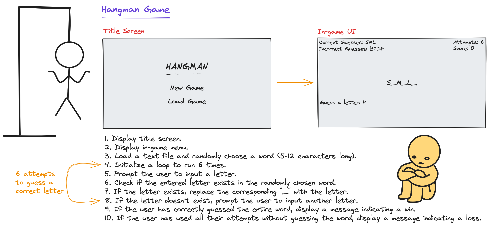
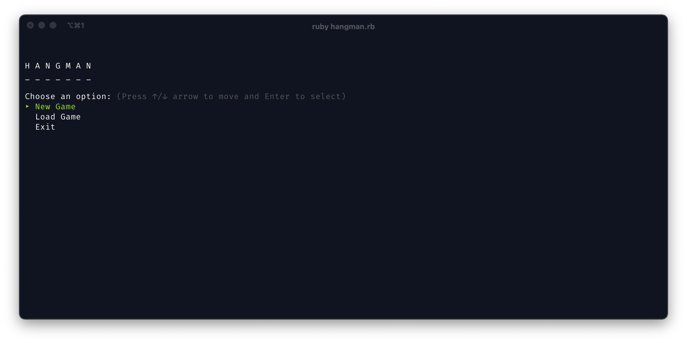
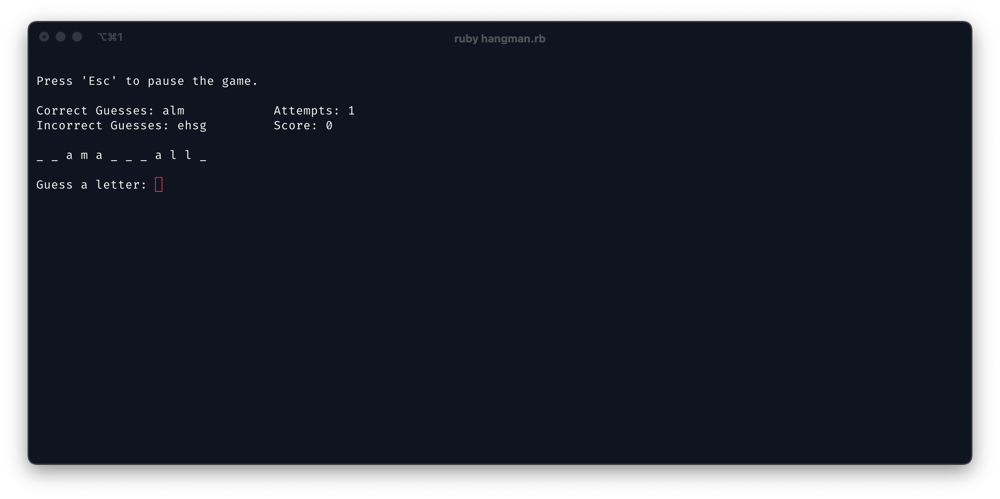
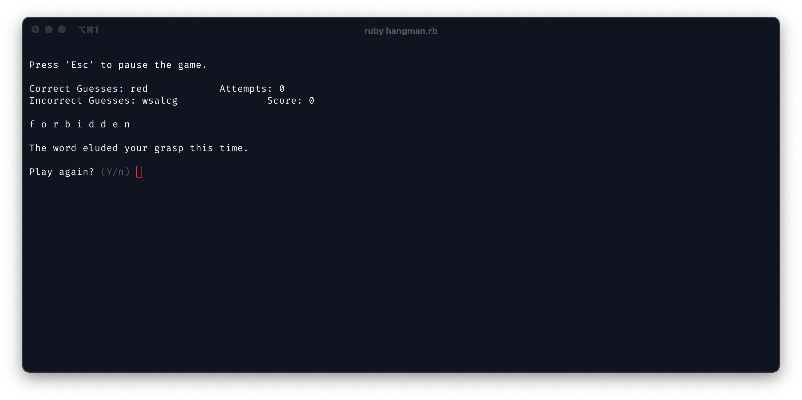
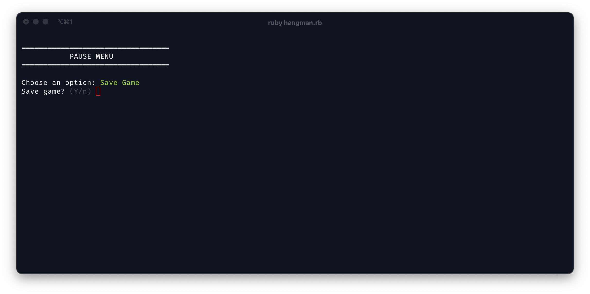
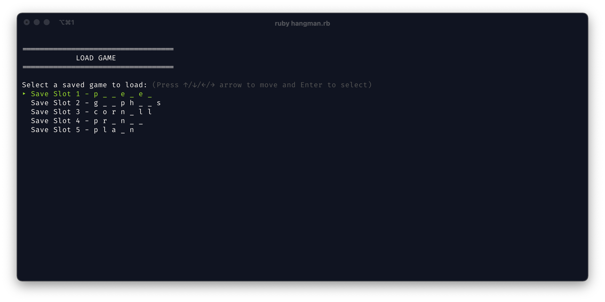

# Hangman

I've developed an engaging Hangman CLI game in Ruby, that comes complete with a save and load game feature.

## Source

[The Odin Project](https://www.theodinproject.com/lessons/ruby-hangman)
